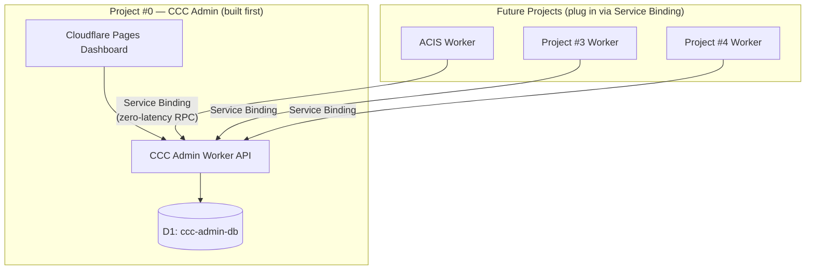

# 001 — Why CCC Admin Exists Before ACIS

**Date:** 2026-04-24  
**Status:** Decided

---

## The Decision

Build a global meta-system (CCC Admin) before writing a single line of ACIS application code.

## The Reasoning

The instinct to build ACIS first is natural — it's the deliverable, it's what impresses the hiring manager. But doing so would have created a structural trap.

If ACIS is built first with its own D1 schema and an Executive Hub dashboard, and then a meta-admin layer is added later, the cost is:
- Restructuring ACIS's database to add meta-tracking tables
- Rewriting the Executive Hub to communicate with an external system
- Retroactively wiring inter-project communication that should have been designed upfront

The "scalable foundation" principle says: if you build the wiring right once, every future project slots in without touching the foundation. That only works if the foundation exists first.

## The Analogy

The user described their AppSheet experience — linked Google Sheets where changes propagate dynamically across the whole app. The lesson from AppSheet isn't the technology; it's the data model discipline. You define your entities and relationships before you build the forms. CCC Admin is that discipline applied to infrastructure.

## What This Unlocks

Every project from here forward follows the same pattern:
1. Register in `projects` table (one INSERT)
2. Add modules to `modules` table
3. Wire Service Binding to CCC Admin Worker
4. Status changes propagate to the activity log automatically

The wiring is done once. The data grows. The dashboard reflects everything without code changes.

## What I'd Do Differently

Nothing on this decision. The sequencing is correct. The only thing worth noting is that the CCC Admin frontend (dashboard) could have been simpler at first — a read-only view of the data — and enhanced iteratively. Instead, the full component structure was built upfront. That's fine for a portfolio (demonstrates capability) but in a production context I'd ship a minimal read-only dashboard first and iterate.
