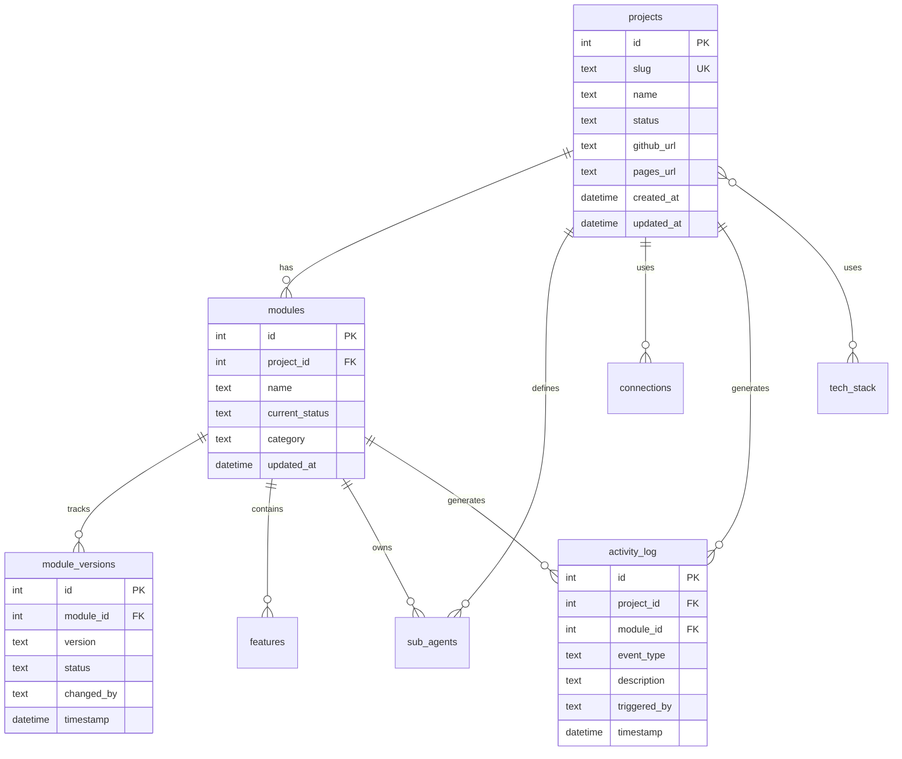

# 003 — Database Schema Design

**Date:** 2026-04-25  
**Status:** Decided

---

## The Decision

8-table normalized relational schema in Cloudflare D1. The `module_versions` table as the audit trail backbone. `activity_log` as the cross-project event timeline.

## Schema Diagram

## Key Design Decisions

### 1. `module_versions` as immutable audit trail
Every status change writes a new row — it never updates an existing one. `modules.current_status` is a denormalized convenience field for fast reads; `module_versions` is the source of truth for history. This mirrors how compliance documentation actually works: you don't overwrite records, you append.

### 2. `tech_stack` as a normalized lookup table
Instead of storing technology names as strings in each project, `tech_stack` is a shared reference table linked via `project_tech_stack`. This means: when a version changes (e.g., Wrangler 4.85 → 5.0), one UPDATE to `tech_stack` reflects everywhere. AppSheet-style dynamic propagation, implemented correctly.

### 3. `activity_log` with nullable FKs
Both `project_id` and `module_id` are nullable so system-level events (not tied to a specific project or module) can still be logged. `ON DELETE SET NULL` ensures orphaned logs aren't lost when a project is removed.

### 4. `connections` stores metadata, never secrets
The connections table tracks which services a project is integrated with and their status — but never stores credentials. Secrets live in Wrangler's encrypted secret store. The table answers "what is connected and is it working?" not "what are the keys?"

### 5. Seed data strategy
CCC Admin registers itself as Project #1 with id=1, ACIS as id=2. Using explicit IDs in the INSERT ensures stable foreign key references in any future seed migrations. If we'd let AUTOINCREMENT assign IDs, re-running seeds on a fresh database could produce different IDs.

## What I'd Do Differently

Add a `deadline DATE` column to `module_versions` earlier. The Sub-Agent Regulatory Analyst spec defines a JSON output with a deadline field, and storing it as part of the version record (rather than inside a TEXT blob) would make deadline-based queries trivial. This will be a migration when ACIS's regulatory ingestion is built.
