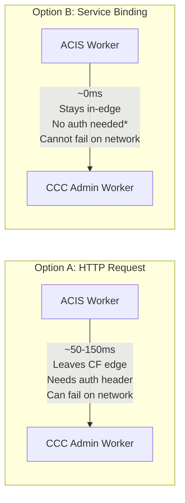

# 005 — Inter-Project Communication: Service Bindings vs HTTP

**Date:** 2026-04-25  
**Status:** Decided

---

## The Decision

Project Workers (ACIS, future projects) communicate with the CCC Admin Worker via **Cloudflare Service Bindings**, not HTTP requests.

## What Service Bindings Are

A Service Binding is a direct in-process reference from one Worker to another. When ACIS needs to report a status change to CCC Admin, instead of:

```
ACIS Worker → HTTP POST → internet → ccc-admin.workers.dev → CCC Admin Worker
```

It does:
```
ACIS Worker → in-process function call → CCC Admin Worker
```

Configured in `wrangler.toml`:
```toml
[[services]]
binding = "CCC_ADMIN"
service = "ccc-admin"
```

Called in code:
```typescript
await env.CCC_ADMIN.fetch(new Request('http://internal/internal/report', {
  method: 'POST',
  body: JSON.stringify({ event_type: 'StatusChange', ... })
}));
```

## Why Service Bindings Win



*Service-bound calls don't leave the Cloudflare network. They're dispatched within the same PoP (Point of Presence). Network failure is not a failure mode.

**Latency:** Near-zero vs 50-150ms for an HTTP round trip  
**Auth:** Service bindings are account-scoped — only Workers in your account can call each other this way  
**Cost:** Doesn't consume a separate Workers request quota  
**Reliability:** No DNS resolution, no TCP handshake, no TLS negotiation to fail  

## The Architecture Signal

Knowing that Service Bindings exist and using them correctly tells a technical reviewer that you understand Cloudflare's execution model at a deeper level than "Workers are just serverless functions." It demonstrates awareness of the edge-native patterns that make Cloudflare's architecture distinctly different from AWS Lambda or GCP Cloud Functions.

## The Tradeoff Acknowledged

Service Bindings only work within the same Cloudflare account. If a future project Worker needed to call CCC Admin from a different account, HTTP would be required. For this portfolio, that constraint doesn't apply — everything lives under the same account.
