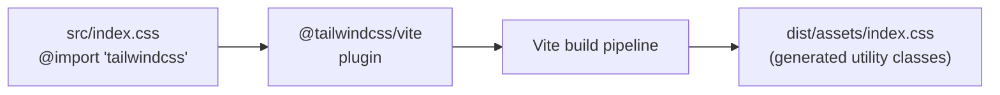

# 006 — Tailwind v4: Plugin Architecture vs CLI

**Date:** 2026-04-25  
**Status:** Decided (breaking change awareness)

---

## The Decision

Use `@tailwindcss/vite` (Tailwind v4 plugin) instead of the traditional PostCSS + CLI approach.

## What Changed in v4

Tailwind v4 restructured how it integrates with build tools:

| | Tailwind v3 | Tailwind v4 |
|---|---|---|
| Integration | PostCSS plugin | Native Vite plugin |
| Config file | `tailwind.config.js` | None (CSS-first) |
| Init command | `npx tailwindcss init -p` | Not needed |
| CSS entry | `@tailwind base; @tailwind components; @tailwind utilities` | `@import "tailwindcss"` |
| Binary | `./node_modules/.bin/tailwindcss` | Does not exist |

## What Broke During Setup

Running `npx tailwindcss init -p` (v3 command) against v4 package failed with "executable not found" because v4 ships no CLI binary. This would have been a silent failure in a less careful setup — the postcss.config.js would have been created but Tailwind classes would silently not generate.

## How v4 Works

The plugin scans source files at build time, generates only the utility classes that are actually used, and injects them through Vite's asset pipeline. No separate config file, no separate build step.

## The Lesson

When a major version of a dependency ships, check for breaking changes in the integration layer — not just the API. Tailwind's API (the class names, the utilities) is largely unchanged; it's the toolchain integration that broke. This is a common trap when upgrading ecosystem tools.

Always check the version you're actually getting (`cat node_modules/tailwindcss/package.json`) before assuming CLI commands from v3 docs will work.
